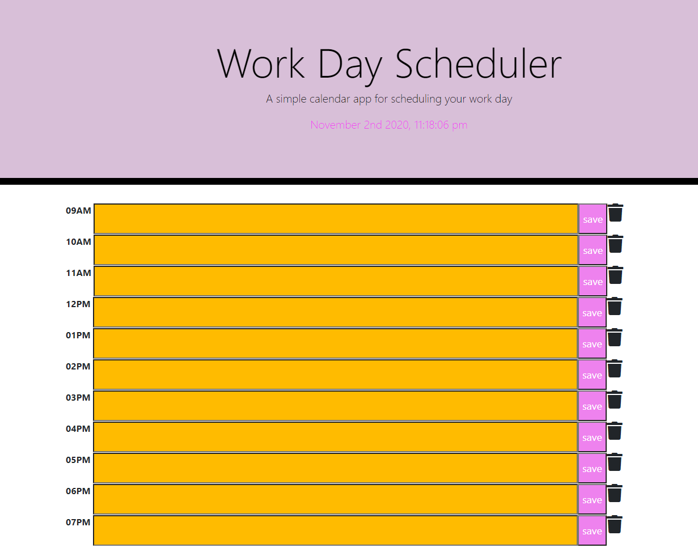

# Workday Scheduler

> AS AN employee with a busy schedule
  I WANT to add important events to a daily planner
  SO THAT I can manage my time effectively

---

### Table of Contents

- [Description](#description)
- [Technologies](#technologies)
- [How To Use](#how-to-use)
- [License](#license)
- [Author Info](#author-info)

---

## Description

Simple dynamic calendar app for scheduling your work day.  

### Technologies

- JavaScript
- JQuery
- Moment.js
- HTML
- CSS
- Bootstrap
- Font Awesome

## How to Use

Open the app and the current date and time is displayed. Input events in the time blocks, save and delete.  

### License

Distributed under the MIT License. See LICENSE for more information.

[Back To The Top](#code-quiz)

---

## Author Info

Fatim Robbins
fmsis@hotmail.com